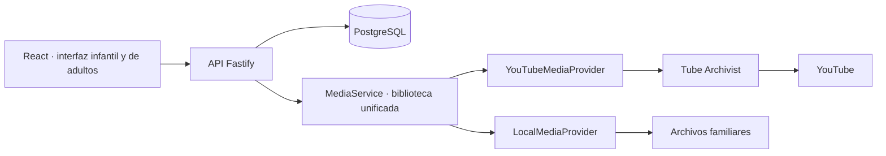

# 🌈 Wawatube

> **¿Qué querés mirar?** Una biblioteca familiar autohospedada, tranquila y bajo control de casa.

[](https://www.typescriptlang.org/)
[](https://react.dev/)
[](https://nodejs.org/)
[](#producción-en-otra-pc)

Wawatube separa la experiencia infantil del área de adultos: los padres eligen y organizan; los niños ven únicamente videos aprobados y disponibles. Los videos de YouTube se descargan con Tube Archivist y los archivos familiares se registran desde una carpeta local. Ambos orígenes comparten categorías, metadata y reproductor nativo.

## Índice

- [Qué incluye](#qué-incluye)
- [Arquitectura](#arquitectura)
- [Requisitos](#requisitos)
- [Instalación y desarrollo](#instalación-y-desarrollo)
- [Configurar Tube Archivist](#configurar-tube-archivist)
- [Usar la biblioteca](#usar-la-biblioteca)
- [Producción en otra PC](#producción-en-otra-pc)
- [Backup y restauración](#backup-y-restauración)
- [Comprobaciones](#comprobaciones)

## Qué incluye

- Inicio infantil con categorías, tarjetas y reproductor nativo sin recomendaciones ni navegación externa.
- Área de adultos protegida por PIN para categorías, visibilidad, videos locales e importaciones de YouTube.
- Estados de vista previa, descarga, disponibilidad y error para que cada importación sea entendible.
- Tema claro/oscuro según el dispositivo, con elección manual persistida.
- Una API y un modelo de biblioteca para los proveedores locales y YouTube.

## Arquitectura



La UI consume el mismo contrato para media local y de YouTube. La API valida la visibilidad y disponibilidad en cada ruta infantil; PostgreSQL conserva categorías, registros y estados, mientras que Tube Archivist administra la descarga de YouTube.

## Requisitos

Linux con systemd, Node **24 LTS**, pnpm **10.30.1**, Docker Engine + Compose v2 o posterior, FFmpeg/ffprobe y Git. Reservar aproximadamente 4 GB de RAM para infraestructura y espacio para videos. En Debian/Ubuntu, instalar FFmpeg con `sudo apt install ffmpeg`; instalar Docker desde sus instrucciones oficiales. No instalar un Node antiguo de la distribución.

Elasticsearch requiere `vm.max_map_count` suficiente. Consultar `sysctl vm.max_map_count`; la recomendación actual de Elastic es `1048576` o mayor. No bajar una configuración existente más alta.

## Instalación y desarrollo

Desde la raíz del repositorio:

```bash
cp .env.example .env
chmod 600 .env
# Editar .env: tres contraseñas distintas y DATABASE_URL coherente.
docker compose --env-file .env -f docker/docker-compose.yml up -d
pnpm install --frozen-lockfile
pnpm db:migrate
pnpm pin
pnpm dev
```

Usamos `--env-file .env` explícito: evita depender del directorio desde donde Compose busque variables. La aplicación se ejecuta directamente en el host; Docker contiene solamente PostgreSQL, Redis, Elasticsearch y Tube Archivist.

`pnpm dev` levanta Vite en `http://localhost:5173` y una API con recarga automática en `:3102`. Vite delega `/api` a esa API. El servicio persistente sigue en `:3100` y sirve la última compilación; no hace falta detenerlo para desarrollar. Ambos procesos comparten la base de datos y los archivos media configurados en `.env`. Si el puerto `5173` está ocupado, Vite falla en vez de abrir otro puerto silenciosamente. Para acceder desde la LAN, usar `http://IP-LAN:5173`. `PUBLIC_ORIGIN` en `.env` corresponde al servicio persistente; `pnpm dev` usa su propio valor para `:3102`.

```bash
docker compose --env-file .env -f docker/docker-compose.yml down
```

`down` preserva volúmenes; **no usar `down -v`** para mantenimiento ordinario.

## Configurar Tube Archivist

1. Abrir `http://127.0.0.1:18000` en el servidor y entrar con `TA_USERNAME`/`TA_PASSWORD`.
2. Copiar API Token desde Settings/Application/Integrations a `TUBE_ARCHIVIST_TOKEN` en `.env`.
3. Reiniciar API. El token nunca se devuelve al frontend.

Desde otra computadora, usar túnel SSH local si hace falta administrar Tube Archivist; su puerto queda enlazado a localhost. No publicar Elasticsearch, Redis ni PostgreSQL en la LAN. `TA_USERNAME`/`TA_PASSWORD` inicializan la cuenta una vez; cambiarlos en `.env` no cambia una cuenta ya creada.

La integración está basada en Tube Archivist **v0.5.12**, Elasticsearch **8.19.0**, Redis **8.10.2** y PostgreSQL **17.11**. Las versiones están fijadas; revisar notas de actualización y hacer backup antes de cambiarlas. La API upstream no garantiza compatibilidad entre versiones.

## Usar la biblioteca

- Niños: `/`. Categoría → video → reproductor nativo, sin contenido recomendado ni navegación externa.
- Padres: `/parent`. PIN → biblioteca, categorías e importaciones. No hay botón administrativo en la UI infantil.
- Imagen de categoría: usa el thumbnail del primer video visible y disponible según el orden del listado. En **Categorías → Editar** se puede elegir otro video de esa categoría o volver a **Automático**. Si el video elegido deja de estar disponible, visible o asignado, se vuelve al primero; sin thumbnail se conserva el emoji.
- Portadas de YouTube: si TubeArchivist devuelve su imagen genérica o falla, Wawatube recupera la portada desde `i.ytimg.com` y conserva una copia en `.cache/thumbnails/`. La interfaz infantil reintenta fallos de carga a los 1, 3 y 10 segundos; no necesita intervención del niño. La detección de imagen genérica corresponde a TubeArchivist v0.5.12.
- YouTube, video individual: pegar URL → esperar metadata → elegir categorías y visibilidad → confirmar.
- YouTube, playlist: elegir **Playlist**, pegar su URL y pulsar **Descargar playlist**. Se puede elegir una categoría para todos los videos o dejar **Sin categoría**. La categoría elegida se agrega a los videos existentes sin quitar sus otras categorías ni cambiar su visibilidad; los nuevos usan la visibilidad seleccionada. La preparación y las descargas continúan en segundo plano, incluso si se cierra la pantalla. Cada video muestra su estado y permite reintentar errores. Solo se importa el contenido actual: no se crea una suscripción a futuras incorporaciones.
- Locales: colocar `.mp4`, `.mkv`, `.webm` o `.mov` debajo de `LOCAL_MEDIA_ROOT`; buscar candidatos en el área de padres y registrar los deseados. El navegador no puede elegir directorios arbitrarios del servidor.
- Ocultar conserva archivo y registro; eliminar de biblioteca conserva archivo original/archivo de Tube Archivist.

Al actualizar una instalación existente para habilitar playlists, ejecutar `pnpm db:migrate` antes de compilar y reiniciar la aplicación. La migración agrega el registro persistente de importaciones de playlists.

La vista **Uso** de la zona de adultos registra segundos de reproducción por día UTC y visualizaciones por video. En instalaciones existentes, ejecutar `pnpm db:migrate` antes de reiniciar para crear las tablas de telemetría.

`LOCAL_MEDIA_ROOT` relativo se resuelve desde la raíz del proyecto. Puede apuntar a una carpeta externa. Identificadores locales son rutas relativas internas: mover toda la raíz conserva referencias; renombrar/mover un archivo dentro de ella requiere actualizar su registro. El servidor rechaza traversal y enlaces simbólicos que salgan de la raíz. No otorgar a usuarios no confiables permisos de escritura sobre ella.

Miniatura local opcional: mismo nombre con extensión `.jpg` o `.png`, por ejemplo `viaje.mp4` + `viaje.jpg`. Si falta, FFmpeg guarda una captura del primer fotograma en `.wawatube-thumbnails/` dentro de `LOCAL_MEDIA_ROOT`; esa carpeta debe permitir escritura. ffprobe extrae metadata; no hay transcodificación del video. Un contenedor admitido no garantiza codecs reproducibles: MP4 H.264/AAC suele ser la opción más interoperable. Si el navegador rechaza un archivo, convertirlo externamente.

La aprobación se valida también en URLs directas, miniaturas y cada nueva petición de reproducción. Ocultar un video no puede retirar bytes que el navegador ya descargó/bufferizó.

## Producción en otra PC

```bash
git clone https://github.com/beecodesolutions/wawatube.git wawatube
cd wawatube
cp .env.example .env
chmod 600 .env
# Configurar contraseñas, raíces y PUBLIC_ORIGIN=http://IP-LAN:3100
docker compose --env-file .env -f docker/docker-compose.yml up -d
pnpm install --frozen-lockfile
pnpm db:migrate
pnpm pin
pnpm build
sudo env NODE_BIN="$(command -v node)" ./scripts/install-service.sh
journalctl -u wawatube -f
```

Instalar dependencias de desarrollo antes del build: TypeScript/Vite son herramientas de compilación. El servicio usa Node directamente y sirve frontend compilado; no requiere Vite en producción. `install-service.sh` usa el usuario que ejecutó sudo, nunca root. El usuario necesita lectura de `.env`, código y media. La ruta de Node se fija en la unidad: reinstalar la unidad si cambia esa ruta.

```bash
sudo systemctl restart wawatube
sudo ./scripts/uninstall-service.sh
```

Desinstalar el servicio no elimina datos ni contenedores. Docker debe arrancar al iniciar el equipo; los contenedores usan `restart: unless-stopped`. La app reintenta el arranque si PostgreSQL aún no está listo.

Sin sudo, se admite `./scripts/install-service.sh --user`. Administrar con `systemctl --user` y `journalctl --user -u wawatube`; desinstalar con `./scripts/uninstall-service.sh --user`. Para arrancar sin iniciar sesión, el usuario debe tener `Linger=yes` (`loginctl show-user "$USER" -p Linger`). Si no está habilitado, un administrador debe habilitarlo explícitamente. No se cambia esa política automáticamente.

Acceso previsto: LAN privada, sin redirección de puertos en el router. `HOST` puede fijarse a la IP LAN para limitar interfaz de escucha. El PIN y las cookies por HTTP no están cifrados en tránsito; para redes no confiables, usar HTTPS y `SECURE_COOKIES=true`. No hay OAuth, cuentas cloud ni acceso público. Descargar YouTube requiere Internet; ver media ya almacenada no debería requerirlo.

## Nombre local sin puerto

En la **máquina destino**, después de instalar y arrancar el servicio de sistema
con `install-service.sh`, ejecutar (Debian/Ubuntu/Pop!_OS, Python 3):

```bash
ip -br addr
# Reemplazar enp3s0 por la interfaz Ethernet o Wi-Fi de esa máquina.
python3 scripts/setup-lan.py --interface enp3s0 --dry-run
sudo python3 scripts/setup-lan.py --interface enp3s0
```

Acceso: **http://wawatube.local**. Para otro nombre o puerto interno:
`--name videoteca --port 3100` (nombre sin `.local`). Se puede repetir el comando.

El script instala NGINX y Avahi con `apt-get`, configura el proxy HTTP en puerto
80 (IPv4/IPv6) y anuncia el nombre solo en la interfaz elegida. Actualiza `.env`
con `HOST=127.0.0.1`, `PORT` y `PUBLIC_ORIGIN`, y reinicia Wawatube y Avahi.
El acceso directo por IP LAN y puerto 3100 deja de estar disponible.
No cambia el hostname del sistema, pero sí el nombre mDNS de Avahi para todo
el equipo; elegir un nombre único en la red. Conserva otras opciones de Avahi,
aunque reescribe su archivo sin comentarios, y no elimina sitios NGINX existentes.
Usar en una máquina sin otro sitio que reclame ese mismo nombre.

Guarda copias privadas de los archivos previos en `/var/backups/wawatube-lan-*`;
`paths.txt` relaciona cada línea con su copia numerada desde `0`. Esas copias
incluyen secretos de `.env`: no compartirlas ni versionarlas. Si falla la
configuración, restaura los archivos e intenta recuperar los servicios;
los paquetes instalados y la habilitación de servicios no se deshacen.

Requiere servicio **de sistema** `wawatube.service` activo; no admite la variante
`install-service.sh --user`. No modifica router ni firewall. Si hay firewall,
permitir TCP 80 y mDNS UDP 5353 en la interfaz LAN. Los clientes deben estar en
la misma red y soportar mDNS; redes de invitados o aislamiento Wi-Fi pueden
impedirlo. Verificar desde otro dispositivo abriendo la URL y reproduciendo un
video. El chequeo automático valida HTTP por NGINX, no resolución mDNS remota.

Prueba del configurador sin modificar servicios:
`python3 scripts/test_setup_lan.py`.

## Túnel temporal para probar desde fuera de casa

Con la API de Wawatube corriendo y `.env` configurado:

```bash
python3 scripts/tunnel.py
```

Requiere Docker accesible por tu usuario, Node, OpenSSL y dependencias del
proyecto instaladas. Descarga imágenes de NGINX y Cloudflare si hace falta.
Muestra URL HTTPS temporal, usuario `wawatube` y contraseña aleatoria nueva.
Todo acceso externo pasa por Cloudflare y exige esa contraseña; el área de
adultos conserva además su PIN. Compartir URL y contraseña permite acceder a
la biblioteca infantil y sus videos.

Por defecto sirve fuentes actuales con Vite: guardar cambios y recargar navegador
basta, sin build ni reinicio manual. WebSocket usa el túnel en puerto 443, sin
fallback al dispositivo del visitante. Para servir el build de producción:
`python3 scripts/tunnel.py --production`.

Dejar esa terminal abierta. **Ctrl+C apaga túnel, proxy y Vite creados por el
script**, y elimina archivos temporales. No detiene API ni modifica `.env`, router
ni servicios de sistema. También limpia ante errores normales y SIGTERM;
un cierre forzado con SIGKILL no permite ejecutar limpieza. Si ocurrió, localizar
contenedores propios con `docker ps --filter name=wawatube-` y detener los que
empiezan por `wawatube-tunnel-` y `wawatube-proxy-` mediante `docker stop <nombre>`.
Cada ejecución recibe URL y contraseña nuevas; no tiene reinicio automático.

Prueba sin abrir túnel: `python3 scripts/test_tunnel.py`.

## Backup y restauración

El backup contiene credenciales: guardar en almacenamiento privado. Nunca subirlo al repositorio. Detener Node antes de ambos procedimientos; la utilidad rechaza una API activa en el puerto configurado.

```bash
sudo systemctl stop wawatube
./scripts/backup.sh /ruta/privada/backup-2026-10-01 --include-local
sudo systemctl start wawatube
```

Sin `--include-local`, los videos familiares **no se duplican**: deben copiarse/montarse por separado en la nueva PC. Los videos de Tube Archivist sí se incluyen siempre.

El script produce un dump lógico PostgreSQL, copias frías de volúmenes Tube Archivist/cache/Elasticsearch/Redis, videos YouTube, configuración y manifest con SHA-256. Detiene los escritores de Tube Archivist y reinicia solamente los servicios que estaban activos. El destino debe estar vacío y fuera de las raíces de media. No editar/copiar videos locales durante el backup.

Para restaurar, usar checkout limpio con las mismas versiones y el mismo `docker-compose.yml` del backup (el script compara su SHA-256), copiar `config.env` del backup a `.env` y ejecutar `chmod 600 .env`. Ajustar rutas/puertos/IP solamente en `.env`; conservar secretos de Tube Archivist/Elasticsearch. **Usar solamente backups propios y confiables.** El restore exige destinos vacíos y no sobrescribe bibliotecas existentes.

```bash
# En instalación nueva, antes de arrancar Tube Archivist:
mkdir -p data/youtube # crear la ruta de TA_MEDIA_ROOT; ajustar si es externa
docker compose --env-file .env -f docker/docker-compose.yml up -d postgres
docker compose --env-file .env -f docker/docker-compose.yml create redis elasticsearch tubearchivist
./scripts/restore.sh /ruta/privada/backup-2026-10-01 --confirm-empty
docker compose --env-file .env -f docker/docker-compose.yml up -d
pnpm db:migrate
pnpm pin
pnpm build
sudo env NODE_BIN="$(command -v node)" ./scripts/install-service.sh
```

En una instalación nueva, configurar `MEDIA_UID` y `MEDIA_GID` con `id -u` e `id -g` del usuario que ejecutará el servicio antes de iniciar Compose; ese usuario debe poder leer `.env` y las raíces de media. Si el restore falla después de escribir PostgreSQL o algún archivo, no repetirlo sobre ese destino: conservarlo para diagnóstico y preparar una instalación nueva con base y volúmenes vacíos antes de reintentar. El script no borra datos automáticamente.

Restablecer PIN invalida sesiones restauradas. Si media local no está incluida, copiarla primero preservando estructura relativa. Código/build/node_modules se regeneran; originales familiares, aprobación/categorías y videos que desaparezcan de YouTube no se pueden regenerar confiablemente. Respaldar `/cache`: contiene datos persistentes, no solo archivos descartables.

## Comprobaciones

```bash
pnpm typecheck
pnpm lint
pnpm test
pnpm format:check
pnpm build
```

Las pruebas de API crean y eliminan un schema temporal aislado en `DATABASE_URL`; requieren PostgreSQL activo. `WAWATUBE_TEST_PIN=... pnpm test:smoke --youtube` prueba el servidor compilado por HTTP: ejecutar únicamente sobre una biblioteca descartable con `prueba-colores.mp4` y su JPG bajo `LOCAL_MEDIA_ROOT`. Ese smoke crea y elimina registros de prueba y necesita Tube Archivist configurado. No ejecutarlo contra una biblioteca con datos personales. Ver [alcance de la validación realizada](docs/validation.md).

## Fuentes del contrato upstream

- [Release v0.5.12](https://github.com/tubearchivist/tubearchivist/releases/tag/v0.5.12)
- [Compose oficial del tag](https://github.com/tubearchivist/tubearchivist/blob/v0.5.12/docker-compose.yml)
- [Autenticación API](https://docs.tubearchivist.com/api/introduction/)
- [Endpoints de cola](https://github.com/tubearchivist/tubearchivist/blob/v0.5.12/backend/download/views.py)
- [Estados de tareas](https://github.com/tubearchivist/tubearchivist/blob/v0.5.12/backend/task/serializers.py) y [consulta por ID](https://github.com/tubearchivist/tubearchivist/blob/v0.5.12/backend/task/views.py)
- [Metadata de playlists](https://github.com/tubearchivist/tubearchivist/blob/v0.5.12/backend/playlist/views.py)
- [Protección de archivos Nginx](https://github.com/tubearchivist/tubearchivist/blob/v0.5.12/docker_assets/nginx.conf)
- [Requisitos Elasticsearch](https://www.elastic.co/docs/deploy-manage/deploy/self-managed/install-elasticsearch-docker-prod)
